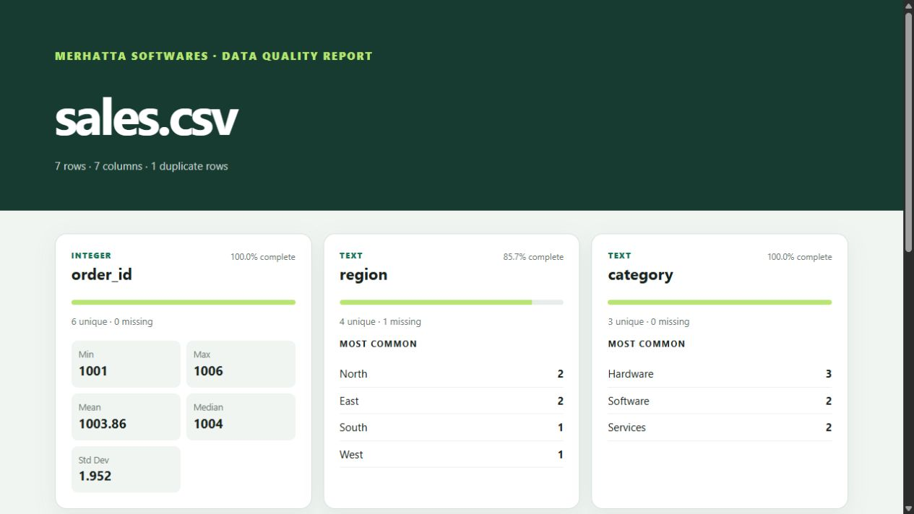

# DataLens CLI

A fast, dependency-free CSV profiler that detects data types, missing values, duplicate rows, distributions, and numeric statistics. Reports can be printed in the terminal or exported as JSON and a polished standalone HTML dashboard.

> Designed and developed by **Merhatta Softwares**.




The repository also includes the complete generated [sample HTML report](docs/demo-report.html).

## Highlights

- Automatically detects comma, semicolon, tab, and pipe delimiters
- Infers integer, number, boolean, date, text, and empty columns
- Measures completeness, cardinality, duplicate rows, and common values
- Calculates min, max, mean, median, and standard deviation
- Produces terminal, JSON, or self-contained HTML reports
- Uses only the Python standard library

## Quick start

```bash
python -m datalens examples/sales.csv
python -m datalens examples/sales.csv --format html --output report.html
python -m datalens examples/sales.csv --format json
```

Or install the `datalens` command locally:

```bash
python -m pip install -e .
datalens examples/sales.csv
```

## Test

```bash
python -m unittest discover -s tests -v
```

## Architecture

`analyzer.py` owns ingestion and profiling, `report.py` owns presentation, and `cli.py` handles command-line concerns. This separation keeps the core easy to test and reuse in a future API or desktop app.

## Suggested resume bullet

> Developed a zero-dependency Python data-quality CLI with delimiter detection, schema inference, descriptive statistics, duplicate analysis, and multi-format reporting.

## About the product

DataLens CLI is a Merhatta Softwares product created for fast, private inspection of tabular data. Version 1.0.0 is an actively maintained portfolio release that keeps data on the user's machine.

See [PROJECT-INFO.md](PROJECT-INFO.md) for ownership, audience, technology, and release details. Contributions are welcome under [CONTRIBUTING.md](CONTRIBUTING.md), and security concerns should follow [SECURITY.md](SECURITY.md).

## License

MIT

Copyright © 2026 Merhatta Softwares.
